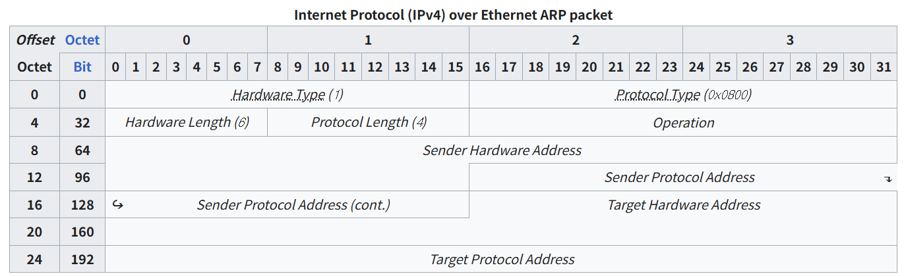

# send-arp

## send-arp 실행 영상

[send-arp 영상](https://youtu.be/itRUpaqz2H0)

## 과제 설명

https://gitlab.com/gilgil/sns/-/wikis/about-arp/about-arp

https://gitlab.com/gilgil/sns/-/wikis/about-arp/report-send-arp

## 공부 내용

### ARP 패킷 구조

- (출처 : https://en.wikipedia.org/wiki/Address_Resolution_Protocol)
    
    
    
- (출처 : https://sambalim.tistory.com/59)

### ARP 스푸핑 개념 및 실습

- kali의 arpspoof 툴 사용
    
    ```bash
    sudo arpspoof -i wlan0 -t <sender ip - victim> <target ip - gateway>
    ```
    
- 실행 방법은 유사한 (사실상 똑같은) 구조로 제작

### pcap_sendpacket

```cpp
pcap_sendpacket(pcap, reinterpret_cast<const u_char*>(&tip_req_packet), sizeof(tip_req_packet))
```

- 사용자 정의 버퍼를 packet으로 전송 가능
- tip_req_packet ⇒ 정의된 버퍼를 사이즈만큼 pcap에 넣음

### getMyMacAddress, getMyIpAddress

- interface 이름 기준으로 mac과 ip 알아오는 함수 `LLM Gemini 사용했습니다.`

> Attacker(자신) Mac 주소 값를 알아 내는 방법은 구글링을 통해서 코드를 베껴 와도 된다
> 
> 
> (반드시 interface 이름을 입력값으로해서 Mac을 알아내도록 한다)
> 

### 구조체 패딩 현상

> Ethernet 헤더와 ARP 헤더 사이에 `00 00` 바이트가 추가되는 현상
> 
- 구조체 패딩
    - (출처 : https://powerdeng.tistory.com/226)
- `__attribute_(packed)`
    - (출처 : http://i5i5.tistory.com/1303)

## 소스 코드

### main.cpp

- `main()` 함수
    - ARP 스푸핑 공격을 수행하는 전체 흐름 제어
        - 실행 인자 받아서 체크
        - pcap으로 패킷 전송 및 수신 준비
        - 자기 자신 mac과 ip 주소 찾기
    - ARP 스푸핑 공격을 수행하는 전체 흐름 제어 반복문으로 구성
        - who has <target_ip>? 요청
        - <target_ip> is <victim_mac> 응답
        - 위조 패킷 보내기
    
- `send_arp_preparing()` 함수
    - ARP 패킷을 생성하고 준비하는 핵심 함수
    - 이더넷 헤더와 ARP 헤더를 모두 설정
    - MAC 주소와 IP 주소를 문자열에서 바이트로 변환하여 패킷 구성

- `getMyMacAddress()` 함수 **(GEMINI 생성 코드)**
    - 지정된 네트워크 인터페이스의 MAC 주소를 가져옴
    - ioctl 시스템 콜을 사용하여 하드웨어 주소 정보 획득
    - 획득한 MAC 주소를 문자열 형태로 반환
- `getMyIpAddress()` 함수 **(GEMINI 생성 코드)**
    - 지정된 네트워크 인터페이스의 IP 주소를 가져옴
    - ioctl 시스템 콜을 사용하여 인터페이스 IP 정보 획득
    - 획득한 IP 주소를 문자열 형태로 반환

### **ethhdr.cpp**

- `stringmac_to_bytemac()` 함수
    - 문자열 형태의 MAC 주소를 바이트 배열로 변환
    - "AA:BB:CC:DD:EE:FF" 형식을 6바이트 배열로 파싱
    - sscanf를 이용해 16진수 문자열을 바이트로 변환
- `bytemac_to_stringmac()` 함수
    - 바이트 배열 형태의 MAC 주소를 문자열로 변환
    - 6바이트 배열을 "AA:BB:CC:DD:EE:FF" 형식으로 출력
    - sprintf를 이용해 바이트를 16진수 문자열로 변환
    

### **arphdr.cpp**

- `stringip_to_byteip()` 함수
    - 문자열 형태의 IP 주소를 32비트 정수로 변환
    - "192.168.1.1" 형식을 네트워크 바이트 순서로 변환
    - 각 옥텟을 적절한 위치로 시프트하여 조합
- `byteip_to_stringip()` 함수
    - 32비트 정수 형태의 IP 주소를 문자열로 변환
    - 네트워크 바이트 순서에서 "192.168.1.1" 형식으로 변환
    - 비트 마스킹과 시프트 연산을 이용해 각 값 추출